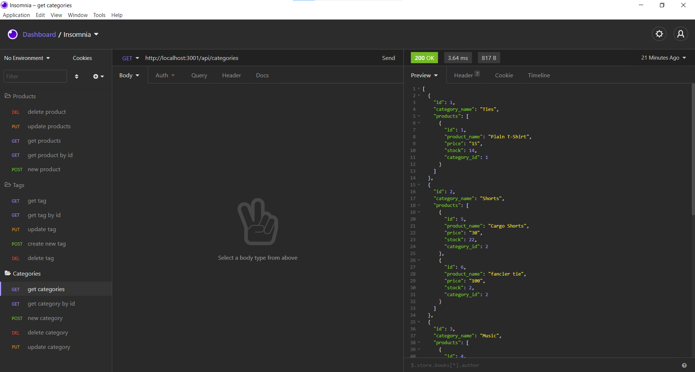
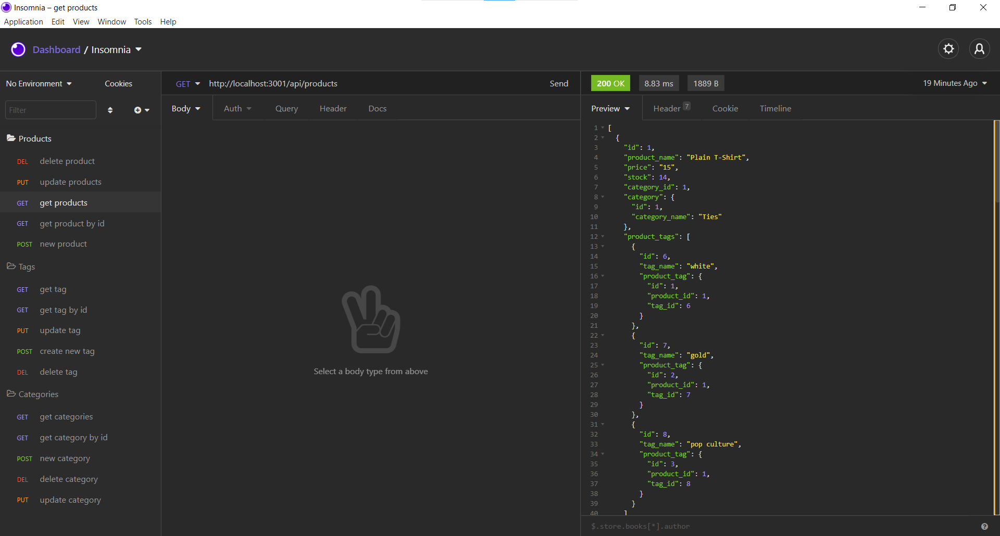
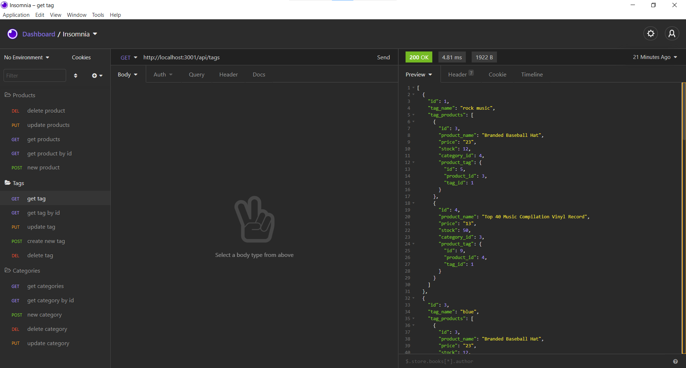

# E-Commerce Back-End

----

## Table of Contents

*[Description](#description)

*[Installation](#installation)

*[Usage](#usage)

*[Contribution](#contribute)

*[How to test](#test)

*[Contact Me](#Contact-Information)
  
## Description
User is able to create, edit, view, and delete products, categories, and tags for an e-commerce site.
  
## Installation
clone the repository, use npm i in the main folder, use mysql -uroot -p < db/schema.sql, type in password when requested.  Use npm run seed to seed mysql.  Rune node server.js.  Pull up insomnia and use as necessary.  
  
## Usage
Once insomnia is pulled up and node server.js is running, click on the needed tab.  You can create a category, tag, or product.  As well as, view, edit, or delete any of these categories.

[Video](https://drive.google.com/file/d/1o61XqQB3-6Akd6hGAJlUr-zrC8oHRrE7/view)

## License
MIT

## Contribution
None
  
## How to Test
Clone repo and use as instructed
  
## Contact-Information
[Github Profile](https://github.com/desantel)

